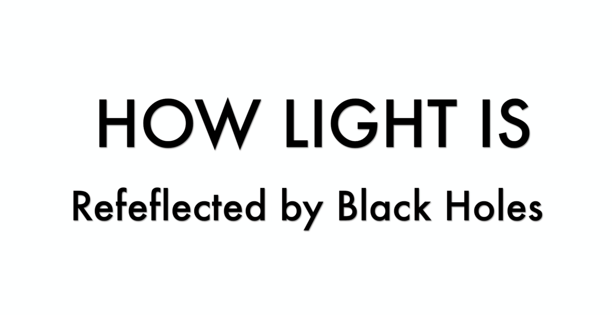

The course description can be found <a href="https://webapp.science.hku.hk/sr4/servlet/enquiry?Type=Course&course_code=PHYS3652" target="_blank">here</a>

* Gravity
    * Keppler's Laws
    * Binary System and mass determination
* Special Relativity
    * Time dialation, legnth contraction
    * Relativistic momentum and energy
    * Doppler shifts, relativistic beaming
* Telescopes
    * Rayleigh Diffraction limit
    * Seeing, atmosphere 
    * Interferometry
*  Atomic structure
    * Bohr model
    * Quantum mechanics
*  Radiative processes 
    * Spectral line transitions
    * Kirshoff's Laws
    * Spectral stellar classification
* Statistical mechaincs
    * Blackbody radiation
    * Boltzman Equation
    * Saha equation 