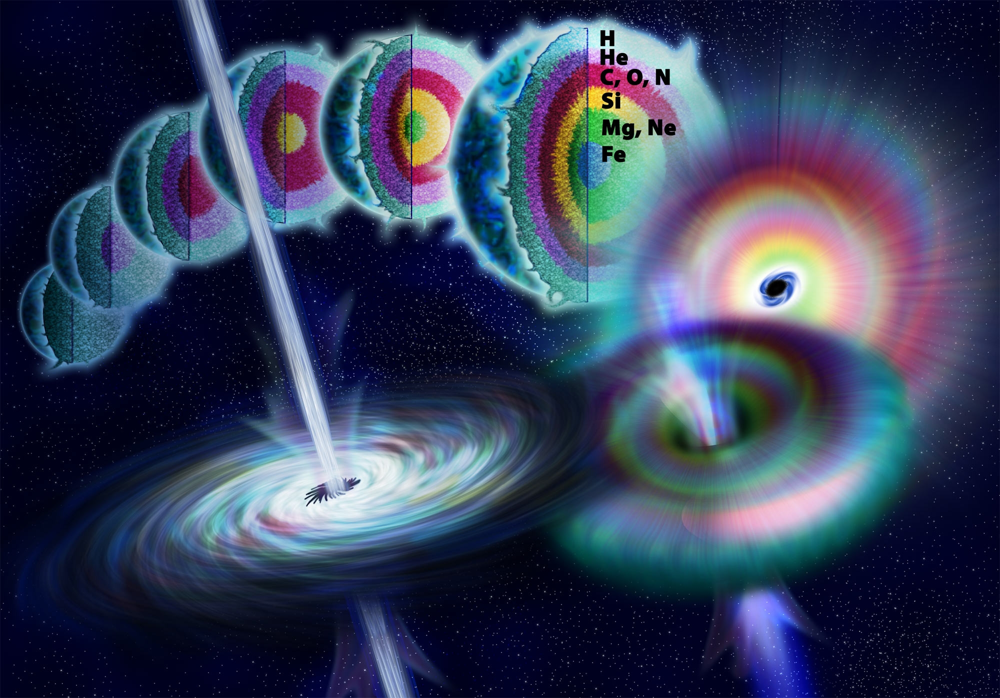
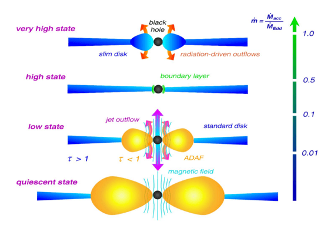
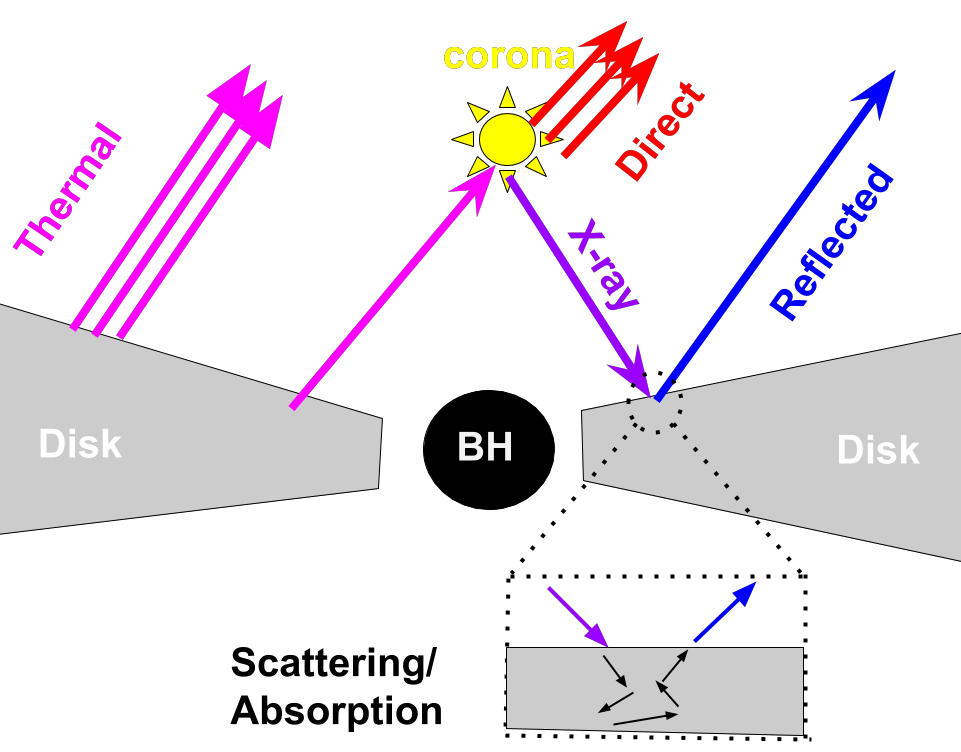
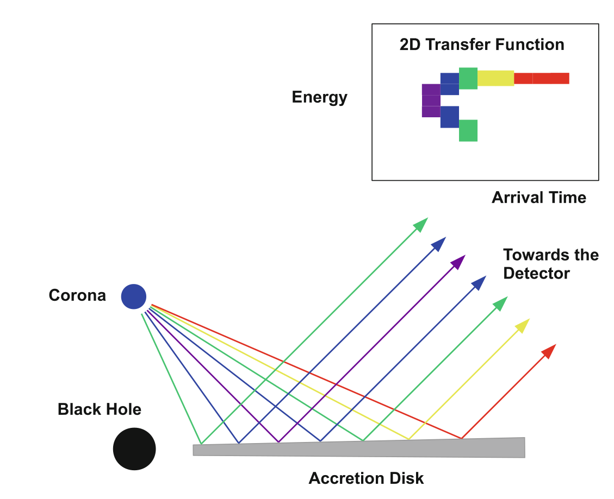
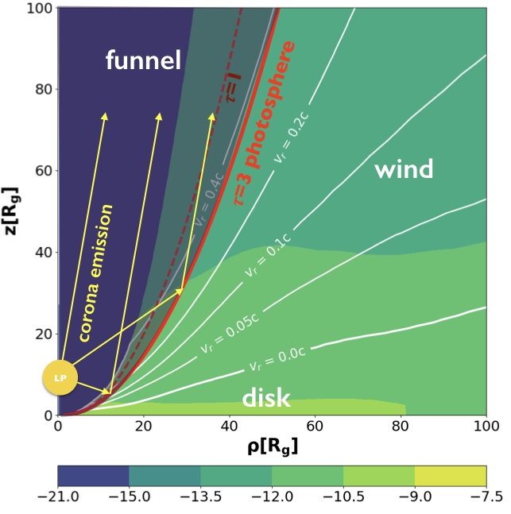

Black holes are some of the most interesting astrophysical objects to study since they can be used to test our theories under the most extreme conditions. Such as two black holes colliding producing gravitational waves, how light and particles move in curved space-time, gravitational lenses and tidal disruption events. In this section, I will introduce black holes, how we can observe black holes, how black holes grow, and lastly how we can use X-ray reverberation as a link between theory/simulations and observation.  
Please
<a href="https://gfh112.github.io/Lars/portfolio/Introduction_X-ray_reverberation" target="_self">click here</a> for a brief video introduction to X-ray reverberation 

Black Holes
======
Black holes obtained their name by being such compact objects that the space-time is so curved that not even light (with velocity c=300,000 km/s) can escape the surface, so they are truly dark. In order for our sun to be a black hole, we need to shrink its radius to just 3 km, which is 200,000 times smaller (200,000^3 smaller in volume).

We usually group black holes into two groups:
* Stellar mass black holes with mass of 5-100 solar masses and radius of order 10 km
* Supermassive black holes with a mass 0.1-1000 million solar masses and a radius comparable to the distance from Earth to the sun.
<figure>
  
    <figcaption>Black hole from the interstellar movie</figcaption>
</figure>

Formation of Black Holes
======
The stellar mass black holes are primarily assumed to be formed after a supernova explosion at the end of high-mass stars' life cycle. Simplified, the black hole is formed when all atoms are turned into iron and no more energy can be extracted by fusion (the primary energy source of stars). The stellar core will continue to contract since there is no radiation pressure pushing back on the gravity, so the core becomes denser and denser until it becomes a black hole and ejects the envelope in an explosion known as a supernova.

The supermassive black holes are found in the centre of galaxies, and we don't know exactly how they got to be so large. The main formation theory of supermassive black holes is they started as normal stellar mass black holes in the early universe and grew in size and mass as they migrated towards to galactic centre by consuming gas and merging with other black holes. However, it is difficult to explain the high mass of some young supermassive black holes without the black holes consuming gas above the so-called Eddington limit. Black holes accreting gas above the Eddington limit are called super-Eddington accretors.

<figure>
  
    <figcaption>Fe builds up in the core until a black hole is formed and the star explodes</figcaption>
</figure>

Observing Black Holes
======
Black holes are black - it is in their name, so how do we observe them? It is true, that we cannot observe black holes by their light, but we can observe some extremely hot gas surrounding the black holes (and recently also gravitational waves where two black holes are merging making ripples in the spacetime continuum). However, due to the extremely small size of black holes and the large distances to them, the black holes appear like point sources in the sky even with the best telescopes in the world.

Only due to some genius design by effectively making a telescope the size of the Earth, we were able to spatially resolve a black hole in 2019 with the Event Horizon Telescope, but this is only possible for very few sources (less than 5). Therefore, if we want to learn more about how black holes grow by accreting gas and the structure of the gas, we need another method to observe and resolve them.

<figure>
  
    <figcaption>M87 black hole observed in 2019 with the Event Horizon</figcaption>
</figure>

Disk Structure
======
First, let's consider what will happen as gas falls towards the black hole. Due to the gas's angular momentum, it will settle in different disk structures depending on how quickly the black hole consumes gas with respect to the Eddington limit (ṁ). For a 1 million solar mass black hole, the Eddington accretion rate corresponds to the black hole growing with 0.02 solar masses per year and the parameter scales linearly with the black hole mass, so the more massive the black hole, the more gas it can consume. Usually, we divide the disk structure into 3 regimes:

Super-Eddington: when the accretion rate is above the limit (ṁ>1). Here the disk is geometrically thick and dense, and strong radiation drive winds can easily be launched.

Classical thin: when the accretion rate is just below the limit (0.05<ṁ<1). Here, the disk will settle into a geometrically thin and dense disk, which rotates with the Kepplerian speed.

Radiative Inefficient Accretion Flow happens when the accretion rate is much below the limit (ṁ<0.05). Here, the disk will be geometrically thick, but due to the low accretion rate, it will no longer be dense.

<figure>
  
    <figcaption> Depending on the accretion rate with respect to Eddington limit (ṁ), we have three structures [Muller 14].</figcaption>
</figure>

X-ray Reflection
======
The standard geometry adopted to explain the X-ray spectra of accreting black holes (Active Galactic Nuclei, AGNs) is shown to the right (or below). This geometry is known as the lamppost model. The disk is assumed to be geometrically thin, and the corona is modelled as a point source located above the black hole from where it radiates non-thermal (power-law distributed) emission in the X-rays. I have created a video (shown here) and a 3D interactive figure (accessed here) illustrating how 10,000 photons isotropically emitted photons will propagate from the corona to the disk. Roughly half the light escapes freely, whereas, the other half irradiates the thin disk producing the "reflection spectrum". Most noticeable in the reflection spectrum is an emission line known as the Fe K-alpha line emitted at restframe energy of 6.4 keV. The total emission in the X-ray is the direct coronal emission (red arrows) and the reflected spectrum contribution (blue arrows).

The reflected Fe K-alpha line will undergo a change in its energy depending on where it is emitted. The disk is rotating. If the gas is moving towards us when emitting the Fe K-alpha line, the photon will gain energy (Doppler blueshift) and if it is moving away from us the photon will lose energy (Doppler redshift). Also, if the Fe K-alpha line is produced close to the black hole, the energy will be redshifted due to gravitational redshift.

<figure>
  
    <figcaption> Illustration of the innermost disk geometry in the thin disk regime. We have a corona located above the black hole where it irradiates isotropically. Roughly half the light escapes and the other half irradiates the disk producing the reflection spectrum. </figcaption>
</figure>
	
X-ray Reverberation
======
As mentioned in "Observing Black Holes", we cannot spatially resolve the black hole or the accretion disk with our current telescopes, so we need another method to constrain the disk geometry. A well proven technique to overcome this problem is X-ray reverberation where we exchange spatial resolution for temporal resolution. This technique is similar to using echos to map dark caves. You send out sound pulses and measure the time it takes for them to reflect and come back, and since we know the speed of sound waves, we can convert the time delay to a distance. However, for black holes, we use light waves instead of sound waves.

The timing resolution in this geometry comes from the corona being highly variable in time. So the corona will increase its luminosity and a few moments later the reflection spectrum will follow and increase as well. The time delay between the increase in the direct coronal emission and reflection spectrum is primarily given by the photon travel time, but close to the black hole, the gravitational time delay is increasingly important.

The time delay together with the energy of the Fe K-alpha lines gives a unique set of parameter for reflection. By comparing the observed time and energy-delay to our model, we can constrain the mass (and hence the size) of the black hole, the height of the corona and the spin of the black hole.

<figure>
  
    <figcaption> Each photon has a unique time delay and energy depending on where they are reflected. Even though the shortest photon path is being reflected close to the black hole, the photon actually arrives late due to gravitational time delay [Bambi 17]. For a 2/3D visualisation of the disk response, please check out the videos in the section Videos. </figcaption>
</figure>
	

X-Ray Reverberation on Super-Eddington Disk Structure
======
Likely super-Eddington accreting sources show often signs of ultrafast winds by having blueshifted absorption/emission lines. In order to investigate the super-Eddington disk structure, we need to use numerical disk simulations since the launching of winds is not self-consistently produced in semi-analytical models. Disk simulations of super-Eddington disk structures do confirm a geometrically thick disk with ultra-fast outflowing, dense winds is formed and depending on the spin of the black hole and magnetic field - an ultra-relativistic jet can also be formed in the simulation.

The super-Eddington disk structure I investigate is shown to the right (or below), and the calculated reflection surface now lies in the ultrafast moving winds, which is morphologically different from the slowly rotating thin disk usually assumed. Therefore, the X-ray reverberation signatures should be different in the super-Eddington accretion case. I have created an interactive figure showing the 3D response of the disk to an instantaneous corona flare for a: Super-Eddington Disk, Thin Disk at Low Inclination and Thin Disk at High Inclination and I have created videos in both 2/3D illustrating how the coronal flare propagates in different disk structure in the section Videos

I am investigating how this difference in reflection geometry propagates in the X-ray reverberation signals and I have come up with observational tools to distinguish the two disk structures. Also, I have laid the foundation to constrain parameters such as wind acceleration and the half-opening angle of the funnel for future observations of super-Eddington accretors in addition to the mass of the black hole and height of the lamppost. You can find the results in my two papers: Article 1 and Article 2.

<figure>
  
    <figcaption> Super-Eddington disk structure for ṁ=15, spin a=0.8, and mass M=5 million solar masses. The reflection surface is the red line where the Fe K-alpha lines will be produced and can freely escape to the observer through the narrow funnel. The colour indicates the density value, which decreases towards the pole and the wind velocity given by the contour lines increases towards the pole. The reflection surface lies in the fast-moving wind and not the exposed disk [Thomsen 2019] </figcaption>
</figure>
